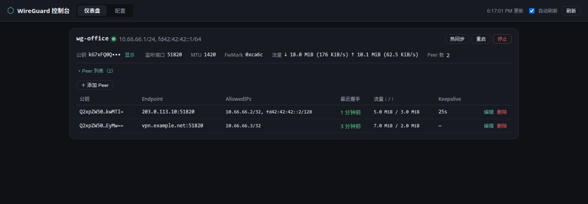
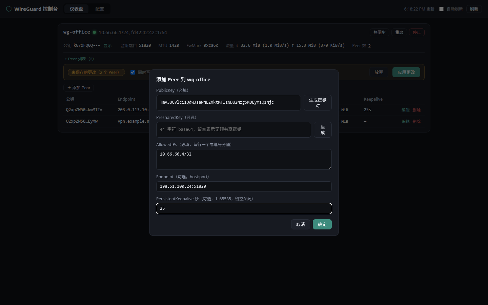
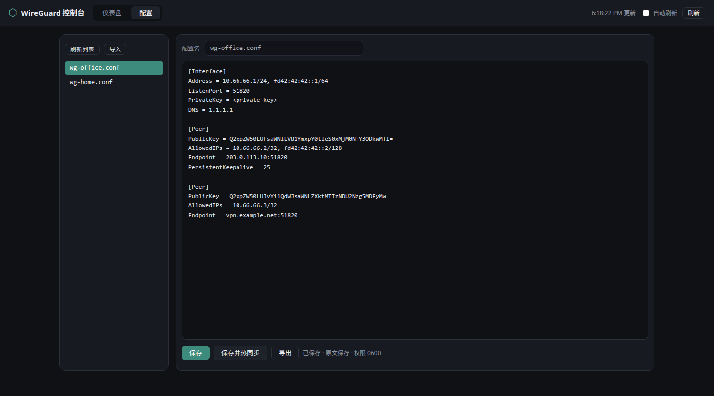
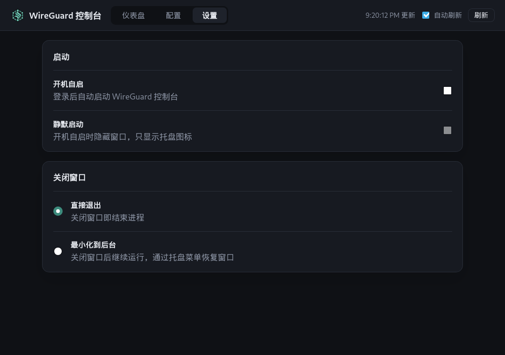

# WireGuard 控制台

<p align="center">
  
</p>

[](LICENSE)

基于 **Tauri v2 + React + TypeScript** 的 WireGuard 桌面管理工具（Linux）。

管理本机的 WireGuard 接口与 Peer：状态监控、Peer 增删改、接口启停、配置文件读写与导入导出。

## 界面预览

截图使用示例配置和脱敏密钥。

### 仪表盘

查看接口地址、监听端口、流量速率、握手时间和 Peer 状态。



### Peer 编辑

添加或编辑 Peer，设置 AllowedIPs、Endpoint 和 PersistentKeepalive。



### 配置中心

读取、编辑、保存、热同步和导出 `/etc/wireguard/*.conf`。



### 启动与关闭

配置开机自启、静默启动和关闭窗口行为。



## 功能

| 模块 | 能力 |
| --- | --- |
| 仪表盘 | 接口状态、地址/MTU/端口、公钥（可脱敏显示）、实时流量与速率、Peer 握手时间（5s 自动刷新） |
| Peer 管理 | 表格内增/删/改，一键生成密钥对与预共享密钥，改动可「仅运行时」或「写入配置并热同步」 |
| 接口控制 | `wg-quick up / down / restart`，`wg syncconf` 热同步（不中断连接） |
| 配置中心 | 读取/编辑 `/etc/wireguard/*.conf`（原始文本），保存、保存并热同步、导入、导出 |
| 设置 | 开机自启、静默启动到托盘、关闭窗口退出或最小化到后台 |

## 安全设计

- **特权桥接**：所有 root 操作经 `pkexec`（polkit）执行，每次操作弹系统授权框；同一会话内 polkit 会记住授权，后续静默放行。
- **密钥不进命令行**：私钥、预共享密钥、`wg setconf` 的配置一律经 **stdin** 传给 `wg`，避免泄露到 `/proc/<pid>/cmdline`。
- **文件名校验**：配置名与接口名均做白名单校验，杜绝路径穿越。
- **文件权限**：通过一次特权 `install -m 600` 写入 `/etc/wireguard/*.conf`，避免权限设置分成两步。
- **安全导出**：导出由当前用户写入 HOME 内路径，并拒绝符号链接目录。
- 私钥在前端默认脱敏显示，手动点击才展开。

## 架构

```
React render modules
  ├─ domain/configuration.ts   配置文档与 Apply Outcome
  ├─ domain/peerEditing.ts     Peer draft、验证与 Apply Mode
  ├─ domain/statusMonitor.ts   采样、速率、single-flight 与授权冷却
  └─ domain/appSettings.ts     开机自启、静默启动与关闭行为
             │
             └─ wireguard.ts（Tauri adapter）
                         │ IPC
Rust wg::ops（配置生命周期与 Runtime Interface 行为）
  ├─ wg/host.rs   Linux adapter：pkexec、命令、文件、sysfs
  ├─ wg/conf.rs   wg-quick 配置解析/序列化
  └─ wg/dump.rs   wg show all dump 解析
```

- 接口流量统计读 `/sys/class/net/*/statistics`（免特权）；地址/MTU 经 `ip -j addr`（免特权）。
- Peer/握手等运行态信息经 `pkexec wg show all dump`。
- 热同步先执行 `wg-quick strip`，再通过 stdin 交给 `wg syncconf`。
- 配置保存和运行时同步分别记录结果，界面可准确提示部分成功。

## 安装

从 [Releases](https://github.com/DHKun/Wireguard-GUI/releases) 下载对应包：

```bash
# Debian / Ubuntu
sudo apt install ./wireguard-gui_0.2.0_amd64.deb

# Fedora / RHEL
sudo dnf install ./wireguard-gui-0.2.0-1.x86_64.rpm

# 任意发行版（AppImage，需系统自带 webkit2gtk-4.1）
chmod +x ./wireguard-gui_0.2.0_amd64.AppImage
./wireguard-gui_0.2.0_amd64.AppImage
```

首次运行需要一次 polkit 授权；如需免密管理（单用户机器），可安装 polkit 规则：

```bash
# /etc/polkit-1/rules.d/50-wireguard-gui.rules
# 允许当前用户在本地活动会话中免密运行 wg / wg-quick / cat / ls / install
```

## 开发

前置：Rust 工具链、Node ≥ 20、`webkit2gtk-4.1`、`pkexec`（polkit）。

```bash
pnpm install
pnpm tauri dev        # 开发模式（Vite HMR + debug 二进制）
```

## 构建

```bash
pnpm tauri build --no-bundle   # 仅产出 release 二进制
pnpm tauri build               # 打包 deb + rpm + AppImage（需 dpkg-deb / rpmbuild / linuxdeploy）
```

> 在较新发行版（如 Fedora 44）上打 AppImage 时，linuxdeploy 自带的旧版
> `strip` 可能不认识新库的 `.relr.dyn` 段而失败，加 `NO_STRIP=true` 即可：
> `NO_STRIP=true pnpm tauri build --bundles appimage`

release 二进制位于 `src-tauri/target/release/wireguard-gui`，安装包位于
`src-tauri/target/release/bundle/{deb,rpm,appimage}/`。

## 测试

```bash
pnpm test                         # TypeScript domain module 测试
cd src-tauri && cargo test --locked  # Rust host、生命周期与 parser 测试
```

## 已知限制

- 配置原文编辑会保留注释；通过 Peer 管理写回结构化配置时会丢弃注释。
- 仅支持 Linux（依赖 pkexec 与 /etc/wireguard 约定）。
- 已停止但存在配置的接口会显示在仪表盘；运行态地址、流量和 Peer 信息在启动后填充。
